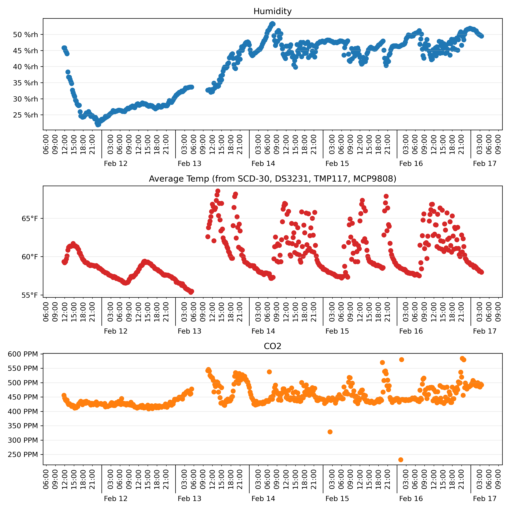

# Raspberry Pi Environmental Data Logger

This project sets up a data logging system for my raspberry pi to monitor
temperature, relative humidity, and CO2 levels.  It presumes you have an
available postgres database to log to.  It also presumes that your Raspberry Pi
has an internet connection.

## Hardware Setup

Adafruit's i2c sensors are very well set up with excelent python integration.
For this project, I used

* [SCD-30](https://www.adafruit.com/product/4867) real CO2 reading which
handles CO2 PPM, % relative humidity, and temperature
* [DS3231](https://www.adafruit.com/product/5188) Real Time Clock (RTC) and
temperature source #2
* [TMP117](https://www.adafruit.com/product/4821) temperature source #3
* [MCP9808](https://www.adafruit.com/product/5027) temperature source #4
* [Stemma QT SHIM](https://www.adafruit.com/product/4463) for easy connection
of the sensors

I opted to use PoE to power my Raspberry Pi since I needed to get a network
connection to it anyhow.  I'm cheap so I used Adafruit's
[USB C PoE Splitter](https://www.adafruit.com/product/4552) (but you can find
them on other online stores too) rather than using a PoE hat.  This also
simplified making the "case" for my setup.

I designed and 3D printed a ["lid"](./Case/Lid.stl) and
[mount panel](Case/Mount.stl) that I could use plastic standoffs to attach
everyting with.  I used M2 standoffs so that I'd have a bit more tollerance
in the hole layouts.  I went with
[this set of standoffs](https://www.amazon.com/gp/product/B01DMJVQVC/) which
includes various lengths of standoffs in addition to M2 plastics screws and M2
nuts.

I used some Dual Lock velcro to affix the Pi and PoE splitter to a beam in my
crawl space.  I used a low-voltage in-wall mounting box/bracket and a
keystone-compatible face plate with some keystone Cat6 female-to-female coupler
jacks to pass ethernet through my wall from my network closet into my crawl
space.

Installed, it looks like this:

## Database Setup

1. Make sure an instance of postgres running somewhere
2. If a new database is needed, set that up
3. Use the contents in the [`ddl.sql`][ddl] file to set up a table,
modify as needed

Note: I used heroku's postgres hosting. They have a free tier that supports
10,000 rows and 20 connections.  This system only uses 1 or 2 connections
and at 15 minute logging frequency, that's 96 records per day or around 100
days of logging.  One caviat with using Heroku is that they ocasionally
perform database "maintaince" that results in the hostname, database name,
user name, and password being changed.  They email before this happens but it
can still be a bit of a hastle.  In the future, I think I'll either install
postgres on the Pi, or once I get my container cluster running, host a
general-purpose postgres database there instead.

[ddl]: ./ddl.sql

## Software Setup

Fill out the [`logging_config_template.ini`][template] file with the pertinent
info.  A copy of this file is used both on the pi and locally for reporting.

[template]: ./logging_config_template.ini

### Logger

1. Set up a Raspberry Pi, probably with raspbian or debian or a similar OS
2. Make sure there's a running ssh server on the pi
3. Install python 3 if it isn't already installed
4. Copy the [`requirements-pi_logger.txt`][req_pi], [`env_logger.py`][script],
and filled out `logging_config.ini` to the pi and make sure the `.ini` and
`.py` files are in the same directory
5. Install the requirements file with
`python -m pip install -r requirements-pi_logger.txt`
6. Set up the `.py` file to be run automatically when the pi launches, perhaps
by
    * Adding a cron entry
      1. Launch cron editor: `crontab -u pi -e`
      2. Add a line like `@reboot python3 /home/pi/env_logger.py`
      3. Save and exit the editor
      4. Reboot
    * Adding it to `rc.local`
      * Untested, but probably with
`su pi -c 'python3 /home/pi/env_logger.py &'`
    * Adding a script to the `init.d` directory
    * SYSTEMD

[req_pi]: ./RPi_Logger/requirements-pi_logger.txt
[script]: ./RPi_Logger/env_logger.py

### Reporting

1. Make sure you have a python 3 environment
2. Install [library requirements][req_rept] with
`python -m pip install -r requirements-local_reports.txt`
3. Copy the filled out `logging_config.ini` file to where you store the
[`plot.ipynb`][plot] file
4. Launch jupyter lab (or use something like VSC) from the same directory as
the ploting notebook
6. Run the notebook to see the plots, optionally edit the query or save the
image

Outputs should look something like

[req_rept]: ./Reporting/requirements-local_reports.txt
[plot]: ./Reporting/plot.ipynb